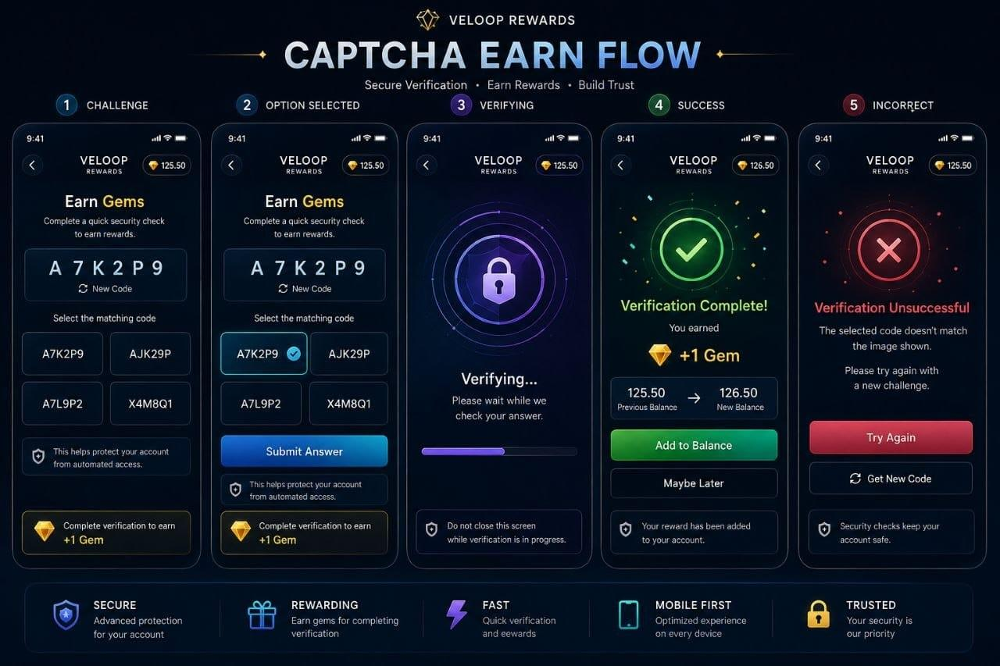

# VELoop Rewards — CAPTCHA Earn Module

[](https://github.com/Narode999/Full-Stack-Captcha-Earn-Module/actions/workflows/ci.yml)
[](https://nodejs.org)
[](https://react.dev)
[](https://expressjs.com)
[](https://www.mongodb.com)
[](backend/tests/security.test.js)

A production-ready MERN module where users solve a one-time CAPTCHA challenge to earn
gems, built on **zero-frontend-trust** principles: the client can request a challenge and
pick an option, but it has **zero influence** over whether it was correct or how much it is
paid.

## 🔗 Live demo

| | |
| --- | --- |
| **Frontend** | https://full-stack-captcha-earn-module.vercel.app |
| **API** | https://full-stack-captcha-earn-module-2.onrender.com |
| **API health** | https://full-stack-captcha-earn-module-2.onrender.com/api/health |
| **Demo login** | `demo@veloop.test` / `Demo@12345` (100 gems) |

Stack: React + Vite (Vercel) · Express + Mongoose (Render) · MongoDB Atlas.



---

## The core idea

Most "earn by clicking" implementations trust the browser. They send the correct answer to
the client, and the client decides what it got. That is trivially cheatable with `curl`.

This module inverts it. The answer lives in the database and **never crosses the wire**:

The full lifecycle — the server decides everything at every step:

```
GET  /api/captcha/current  ->  { challengeId, captchaText, options[4], signature, expiresAt }
POST /api/captcha/verify   <-  { challengeId, selectedOption, signature }
POST /api/captcha/verify   ->  { result: "CORRECT", reward: { amount: 1, status: "PENDING" } }
POST /api/captcha/claim    <-  { challengeId }          ("Claim" or "No Thanks")
POST /api/captcha/claim    ->  { claimed: true, newBalance: 126.5 }   ← wallet moves HERE
```

Two things to notice:

- **The answer never crosses the wire.** There is no `correctOption` in any response — not
  in the challenge payload, not in the verify response, not in an error. A client that never
  solves a single puzzle is still just guessing at four strings.
- **The balance does not move at verify time.** A correct solve records a `PENDING` reward.
  The wallet is credited only when the user claims, and that claim is a compare-and-swap, so
  it can pay exactly once no matter how many times the button is mashed.

---

## Security model

| Threat | Defence |
| --- | --- |
| Read the answer out of the API | `correctOption` is `select: false`, is stripped by a schema `toJSON` transform, and is excluded again by an explicit payload builder — three independent barriers |
| Forge a "correct" result | Request bodies are whitelisted. Any attempt to send `isCorrect`, `reward`, `newBalance`, `type`… returns `400 CLIENT_OVERRIDE_REJECTED` and names the offending fields |
| Replay a solved challenge | The challenge is claimed **first** via compare-and-swap on `status: 'ACTIVE'`. Only the request that actually flips it to `COMPLETED` may be paid |
| Claim the same reward twice | `rewardStatus` moves `PENDING → CLAIMED` by compare-and-swap. 5 parallel claims → exactly 1 winner, 4× `409` |
| Double-spend via concurrency | Claim-then-credit. The credit is a single atomic `$inc` whose post-image is the authoritative balance. 6 parallel verifies → exactly 1 winner, balance moves by exactly one reward |
| Read another user's balance | Every challenge query is scoped by `userId`, so another account's challenge is simply *not found* — it cannot even be probed for existence |
| Replay across accounts | The challenge is HMAC-signed against `challengeId + userId + expiresAt`; the signature is re-verified server-side on every submission |
| Farm by cycling codes fast | Per-user rate limiters (20 verifies/min, 30 issues/min, 20 claims/min) plus a 300 ms minimum human-reaction floor |
| Keep N tabs open and brute force | Issuing a new challenge discards any still-open one — only one `ACTIVE` challenge may exist per user |
| Poison the ledger | `GemTransaction.amount` is enum-constrained to the two server rewards, and `referenceId` is **unique** — one reward per challenge, enforced by the database |
| Edit the balance in the browser | `localStorage` is only a session cache. `GET /api/wallet/gems` is the sole authority and the UI re-reads it after every claim |

### The bug this project was built to avoid

The original implementation credited the wallet **before** claiming the challenge:

```js
// DO NOT DO THIS
const wallet = await Wallet.findOneAndUpdate({ userId }, { $inc: { reward } }); // pays
const claimed = await CaptchaChallenge.findOneAndUpdate({ status: 'ACTIVE' }, ...);
if (!claimed) return error;  // ...but the gems are already gone
```

Two concurrent requests could both credit before either won the claim, and the loser kept
the reward anyway. The fix is to claim first, then credit — see
`verifyCaptcha` in `backend/src/controllers/captcha.controller.js`.

A second, subtler trap is documented in the same function: combining `$inc` with
`setDefaultsOnInsert` in a single upsert. MongoDB may apply `$setOnInsert` *after* `$inc`,
silently discarding the reward. The two operations are deliberately split.

---

## Tech stack

- **Backend** — Node.js, Express 4, MongoDB + Mongoose 8, JWT (`jsonwebtoken`), `bcryptjs`, `express-rate-limit`
- **Frontend** — React 18, Vite 6, Framer Motion, Lucide icons, plain CSS
- **Testing** — `node:test` + `supertest`

---

## Quick start

**Prerequisites:** Node 18+ and a running MongoDB.

```bash
# 1. Backend
cd backend
npm install
cp .env.example .env        # then edit JWT_SECRET and SERVER_SECRET
node scripts/fix-indexes.js # one-off: clears a stale unique index, safe to re-run
node seed/seed.js           # optional: creates demo@veloop.test / Demo@12345
npm run dev                 # http://localhost:5000

# 2. Frontend (new terminal)
cd frontend
npm install
npm run dev                 # http://localhost:5173
```

Open <http://localhost:5173> and log in with the seeded demo account:

```
demo@veloop.test  /  Demo@12345     (100 gems)
```

Or register a new account — you start at **125.50 Gems**.

The Vite dev server proxies `/api` to the backend, so the browser only ever talks to one
origin — no CORS preflight, and no backend URL baked into the bundle.


---

## Environment

`backend/.env` (copy from `.env.example`):

| Variable | Purpose |
| --- | --- |
| `MONGO_URI` | Mongo connection string |
| `JWT_SECRET` | Signs user session tokens |
| `SERVER_SECRET` | HMAC key binding a challenge to its owner and expiry. **Must differ from `JWT_SECRET`** |
| `PORT` | API port (default 5000) |
| `TEST_MONGO_URI` | Separate database used by `npm test`, so tests never touch dev data |

Generate real secrets with:

```bash
node -e "console.log(require('crypto').randomBytes(48).toString('hex'))"
```

> `.env` is git-ignored. The values in the local `.env` are dev placeholders and **must** be
> replaced before any deployment.

---

## API

All `/api/captcha/*` routes require `Authorization: Bearer <jwt>`.

### `GET /api/captcha/current`

Returns the user's live challenge, minting one if they have none.

```json
{
  "success": true,
  "challenge": {
    "challengeId": "ch_888dd660-...",
    "captchaText": "PTBBJP",
    "options": ["PTBBJP", "PFBBJP", "EKRQB5", "PTBPJP"],
    "expiresAt": "2026-09-25T14:06:43.000Z",
    "signature": "9f2c...a71b"
  },
  "reward": { "correct": 1, "wrong": 0.5, "currency": "GEMS" }
}
```

### `POST /api/captcha/verify`

```jsonc
// request — only these three fields are read
{ "challengeId": "ch_...", "selectedOption": "PTBBJP", "signature": "9f2c..." }
```

```json
{
  "success": true,
  "result": "CORRECT",
  "reward": { "amount": 1, "currency": "GEMS", "status": "PENDING" },
  "newBalance": 125.5,
  "challengeId": "ch_...",
  "claimAvailable": true
}
```

### `POST /api/captcha/claim`

```jsonc
// request
{ "challengeId": "ch_..." }
```

Pays the `PENDING` reward into the wallet exactly once.

```json
{
  "success": true, "claimed": true,
  "reward": { "amount": 1, "currency": "GEMS", "status": "CLAIMED" },
  "balanceBefore": 125.5, "newBalance": 126.5
}
```

| Code | HTTP | Meaning |
| --- | --- | --- |
| `ALREADY_CLAIMED` | 409 | Already claimed — nothing is paid twice |
| `REWARD_FORFEITED` | 409 | User chose "No Thanks" |
| `CHALLENGE_NOT_COMPLETED` | 409 | Not verified yet |
| `CHALLENGE_NOT_FOUND` | 404 | Not yours / doesn't exist |

### `POST /api/captcha/decline`

The "No Thanks" path. Marks the reward `FORFEIT` so it can never be claimed later,
then the UI requests a fresh challenge.

### `GET /api/captcha/history?limit=20`

The caller's own completed challenges. A `?userId=` parameter is **ignored** — identity
comes from the JWT alone. `correctOption` is never selected.

### `GET /api/wallet/gems`

```json
{ "success": true, "balance": 126.5, "lifetimeEarned": 126.5 }
```

### Error codes

| Code | HTTP | Meaning |
| --- | --- | --- |
| `CLIENT_OVERRIDE_REJECTED` | 400 | Client tried to dictate the result or reward |
| `INVALID_INPUT` | 400 | Missing `challengeId`, `selectedOption` or `signature` |
| `INVALID_OPTION` | 400 | Selected option was never offered |
| `BOT_SUSPECTED` | 400 | Solved faster than a human could |
| `INVALID_SIGNATURE` | 403 | HMAC did not verify |
| `CHALLENGE_NOT_FOUND` | 404 | No such challenge **for this user** |
| `CHALLENGE_ALREADY_COMPLETED` | 409 | Replay — nothing was paid |
| `CHALLENGE_EXPIRED` | 410 | Past its 2-minute TTL |
| `RATE_LIMITED` | 429 | Too many attempts |

---

## Data model

**CaptchaChallenge** — `challengeId`, `userId`, `captchaText`, `options[4]`,
`correctOption` *(hidden)*, `status` (`ACTIVE|COMPLETED|EXPIRED|DISCARDED`), `expiresAt`.

**Wallet** — `userId`, `gemBalance` (default **125.50**), `lifetimeEarned`.

**GemTransaction** — `transactionId`, `userId`, `amount` (1.0 or 0.5 only), `type`,
`referenceId` (unique → one reward per challenge), `balanceBefore`, `balanceAfter`.

Options are generated with `crypto.randomInt` (never `Math.random`) as 1 correct +
2 single-character confusable distractors + 1 unrelated code, shuffled and de-duplicated.

---

## Testing

```bash
cd backend && npm test
```

20 tests covering answer confidentiality, client-override rejection, the claim
lifecycle, **concurrent verify and concurrent claim races**, expiry, cross-user
isolation, signature tampering, the bot floor, auth, and challenge recycling.

```
tests 20 | pass 20 | fail 0
```

---

## Documentation

| File | Contents |
| --- | --- |
| `docs/API.md` | Every endpoint with auth, request, response, validation and errors |
| `docs/SECURITY.md` | Threat model, the 11 controls, and the two bugs that shaped the design |
| `docs/TESTING.md` | Every test explained, plus manual verification steps |
| `docs/DATABASE.md` | Schemas, indexes, the state machine, legacy-index fix |
| `docs/SCALING.md` | **Section 96** — how this scales to 100,000 attempts/day without double-paying, replaying, or inconsistent balances |
| `postman/VELOop-Captcha.postman_collection.json` | Full flow + 12 negative tests, variables auto-captured |

---

## Project structure

```
backend/
  src/
    config/       db.js, reward.config.js        (frozen reward values)
    controllers/  captcha.controller.js, auth.controller.js
    middleware/   auth.js, rateLimiter.js, verifySignature.js
    models/       CaptchaChallenge, Wallet, GemTransaction, User, AuditLog
    routes/       captcha, auth, wallet
    services/     captcha.service.js    CSPRNG generation, public payload
                  reward.service.js    the only place a reward is decided
                  wallet.service.js    the only place a balance is written
                  audit.service.js     append-only security trail
  seed/           seed.js                        demo@veloop.test
  scripts/        fix-indexes.js, verify-db.js, cleanup-collections.js,
                  extract-spec.js
  tests/          security.test.js

frontend/
  src/
    components/   OptionCard, CheckingState, ResultModal, CinematicBackdrop
    context/      AuthContext, WalletContext
    lib/          api.js                          (single fetch wrapper)
    pages/        Dashboard, CaptchaEarn (5-state flow), History
    App.jsx       (router), main.jsx, styles.css

docs/             API.md, SECURITY.md, TESTING.md, DATABASE.md
postman/          VELOop-Captcha.postman_collection.json
```

